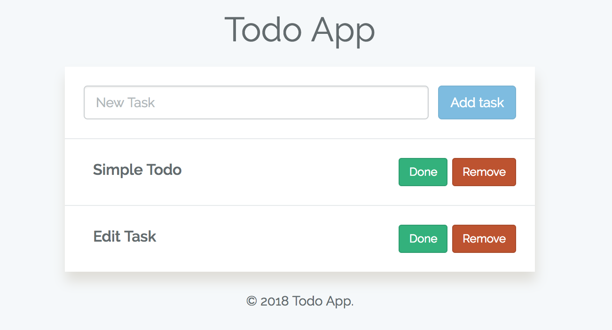

# Todo App



# Install

```
git clone https://github.com/daiarock/todo-app.git
cd todo-app

composer install
yarn install

cp .env.example .env
php artisan key:generate
touch database/database.sqlite
php artisan migrate
php artisan serve
```

Go to http://localhost:8000